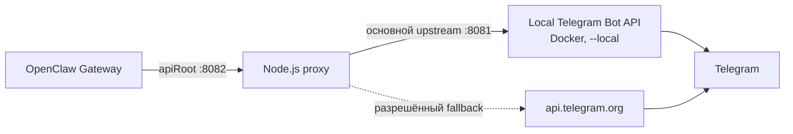

# OpenClaw Telegram Bot API Proxy

Production-ready local-first proxy между OpenClaw и Telegram Bot API. Он даёт
OpenClaw преимущества локального Bot API для больших файлов и одновременно
ограничивает аварийный cloud fallback так, чтобы не смешивать очереди updates,
не повторять файловые upload и не отправлять тяжёлые файлы в cloud API.

## Текущая схема



Компоненты выполняют разные задачи:

- OpenClaw принимает и маршрутизирует сообщения, но не решает, какой Telegram
  upstream безопасен.
- Proxy координирует polling, защищает `update_id`, выбирает upstream,
  переписывает local `file_path` и маскирует bot token в логах.
- Local Bot API хранит Telegram-сессию и очередь на persistent Docker volume,
  скачивает файлы без лимита Bot API cloud и возвращает локальные пути.
- Cloud Bot API используется только там, где fallback разрешён политикой.

## Маршрутизация

| Запрос | Основной путь | Cloud fallback |
| --- | --- | --- |
| `getUpdates` | Local, с FIFO-сериализацией и retry | Только после network/timeout/5xx и только при известном native cloud cursor |
| `getFile` | Всегда сначала local, независимо от короткого health-check | Для cloud-sourced `file_id` или подтверждённо малого файла |
| `/file/...` | По source affinity успешного `getFile` | Только cloud-sourced файл с известным размером не выше cloud-лимита |
| `multipart/form-data` upload | Local streaming | Запрещён |
| `close`, `logOut`, `setWebhook` | Local | Запрещён |
| Обычные методы | Local, пока он доступен | Разрешён политикой при явной local-ошибке |

Успешный пустой local `getUpdates` считается нормальным ответом. По умолчанию
он не запускает cloud probe. Опциональный empty-local rescue существует, но
выключен: без persistent cross-source ledger он может породить зеркальные
дубли.

Подробный поток и границы гарантий: [docs/architecture.md](docs/architecture.md).

## Защита polling

- Полный `getUpdates` cycle выполняется под отдельным FIFO lock для каждого
  публичного bot ID. Разные боты polling-ятся параллельно.
- По умолчанию допускаются один активный и четыре ожидающих polls на bot ID.
  Переполнение получает HTTP 429 до накопления request body.
- Незавершённое тело `getUpdates` получает HTTP 408 через пять секунд и
  освобождает admission slot.
- Local long poll ограничен десятью секундами и получает до четырёх попыток при
  timeout, сетевой ошибке или HTTP 5xx.
- Proxy отбрасывает local updates ниже клиентского floor, подтверждает их local
  API через служебный `timeout=0` и при необходимости переводит native local и
  cloud ID в одну виртуальную шкалу.
- `LOCAL_UPDATE_STATE_SEED` восстанавливает проверенную local↔virtual пару после
  restart. Для нового seed `virtualFloor` берётся из максимального event ID
  конкретного bot/account в durable ingress OpenClaw, а не только из ACK cursor.

## Большие файлы

1. Из успешного `getUpdates` proxy на 30 минут запоминает bot-scoped `file_id`,
   источник и известный `file_size`.
2. `getFile`, которому разрешён cloud fallback, делает до трёх быстрых
   15-секундных local-попыток. Тяжёлый или неизвестный файл, который обязан
   остаться local, получает отдельное общее окно скачивания: два часа по
   умолчанию на все попытки. Короткий health-check на это окно не влияет.
3. Успешный local `file_path` переписывается из контейнерного префикса в путь
   host-mounted volume, доступный OpenClaw.
4. Связь `file_path → upstream` хранится пять минут. Поэтому последующий
   `/file/...` не скачает local-файл через cloud и наоборот.
5. Cloud-download разрешён только для cloud-sourced файла с известным размером
   не выше `CLOUD_FILE_FALLBACK_MAX_BYTES` (по умолчанию 20 MiB).

У OpenClaw есть два независимых ограничения: `mediaMaxMb` и клиентский
`timeoutSeconds`. Первый должен вместить файл, второй — быть больше
`LOCAL_GETFILE_DOWNLOAD_TIMEOUT_MS`, иначе OpenClaw оборвёт HTTP-запрос раньше
proxy. Пример для 4 GiB и двухчасового окна proxy с пятиминутным запасом:

```json
{
  "channels": {
    "telegram": {
      "mediaMaxMb": 4096,
      "timeoutSeconds": 7500
    }
  }
}
```

## Требования

- Node.js 22 или новее;
- local Telegram Bot API в режиме `--local` на loopback-интерфейсе;
- persistent `/var/lib/telegram-bot-api` volume;
- OpenClaw Telegram `apiRoot`: `http://127.0.0.1:8082`;
- OpenClaw Telegram `timeoutSeconds` больше proxy
  `LOCAL_GETFILE_DOWNLOAD_TIMEOUT_MS / 1000`;
- корректный host path в `LOCAL_FILE_PATH_REWRITE_TO`.

## Запуск

```bash
cp .env.example .env
docker compose -f docker-compose.example.yml --env-file .env up -d telegram-bot-api
npm run check
ENABLE_CLOUD_FALLBACK=1 node src/telegram-bot-api-proxy.mjs
```

Для постоянного запуска используйте
`systemd/openclaw-telegram-api-proxy.service.example`. Entrypoint импортирует
соседние модули, поэтому устанавливается весь каталог `src/`, а не один файл.

Минимальная настройка OpenClaw account:

```json
{
  "apiRoot": "http://127.0.0.1:8082"
}
```

Все параметры и безопасные команды проверки находятся в:

- [.env.example](.env.example) — runtime defaults;
- [docs/architecture.md](docs/architecture.md) — текущая архитектура и
  failure semantics;
- [docs/operations.md](docs/operations.md) — эксплуатация и диагностика.

## Границы гарантий

- Cursor mapping, cloud cursor и file affinity хранятся в RAM. Проверенный
  local bridge можно восстановить seed, cloud state после restart начинается
  заново.
- Proxy не заявляет exactly-once: потерянный HTTP-ответ может быть повторён, а
  downstream side effects не входят в одну транзакцию с Telegram.
- FIFO lock действует внутри одного proxy process. Второй proxy, прямой
  `getUpdates` consumer или webhook может конкурировать и получить Telegram
  `409 Conflict`.
- При неизвестном cloud cursor `getUpdates` закрывается local-ошибкой. Это
  сознательный fail-closed режим: он сохраняет cloud backlog вместо его
  случайного подтверждения высоким virtual offset.
- Удаление persistent Docker volume или ручные `logOut`/`close` меняют
  Telegram ownership и требуют отдельной операторской процедуры.
