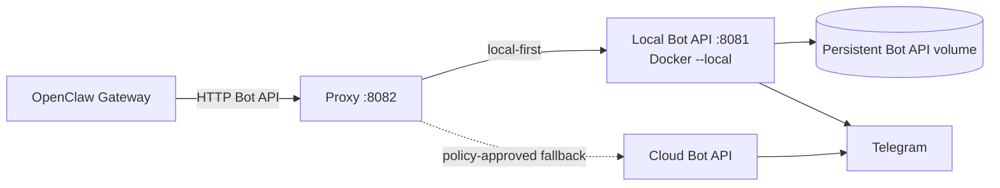
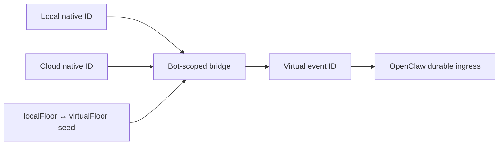

# Текущая архитектура

Этот документ описывает работающий runtime. История разработки, промежуточные
PR и нереализованные варианты здесь намеренно отсутствуют.

## Компоненты



### OpenClaw Gateway

Каждый Telegram account использует proxy как `apiRoot`. Gateway управляет
sessions, durable ingress, прикладным лимитом `mediaMaxMb` и клиентским
`timeoutSeconds`. Последний должен быть длиннее proxy download window. Gateway
не знает о local/cloud source affinity.

### Proxy

Один Node.js process:

- слушает только loopback `127.0.0.1:8082`;
- разбирает Telegram Bot API route и нормализует имя метода без учёта регистра;
- координирует `getUpdates` отдельно для каждого bot ID;
- защищает native/virtual `update_id`;
- хранит краткоживущую media affinity;
- применяет fallback policy;
- переписывает local `file_path` в host path;
- маскирует bot token в operational logs.

### Local Telegram Bot API

Docker-контейнер слушает `127.0.0.1:8081`, работает с `--local` и использует
persistent volume `/var/lib/telegram-bot-api`. Этот upstream обслуживает
основной polling, большие download и streaming upload.

### Cloud Telegram Bot API

`https://api.telegram.org` — ограниченный аварийный upstream. Его очередь
updates и native ID не считаются идентичными local API. Cloud никогда не
получает multipart upload и не используется для тяжёлого/неизвестного файла.

## Общий HTTP-путь

1. Proxy percent-decode-ит path один раз, извлекает token и canonical method.
   Некорректная кодировка, route без метода и test-DC route получают HTTP 400.
2. `getUpdates` всегда читает bounded body. JSON/form/малые API-запросы до
   `BUFFER_LIMIT_BYTES` также буферизуются. `/file/...`, multipart и прочие
   большие тела идут streaming-путём.
3. Короткий local health-check использует `getMe`; успешный результат
   кэшируется. Это ускоряет обычные запросы, но не отменяет обязательную local
   попытку `getFile`.
4. Ответ проходит method-specific guard, после чего возвращается OpenClaw.
   Логи содержат target, status, latency, fallback reason и streaming counters.

## `getUpdates`

### Admission и FIFO lane

Proxy резервирует bot-scoped admission slot до чтения body. По умолчанию на
один bot ID разрешены один активный и четыре ожидающих requests.

- Переполнение: HTTP 429 и `Retry-After: 1`.
- Незавершённое body дольше пяти секунд: HTTP 408, connection close и
  освобождение slot.
- Клиент отключился в очереди: request удаляется без upstream side effect.
- Клиент отключился после начала cycle: upstream cycle завершается под lock,
  потому что Telegram уже мог применить offset.

Только один полный cycle данного bot ID одновременно выполняет health-check,
local retry, cursor translation, stale filtering, ACK и cloud decision. Другие
bot ID работают параллельно.

### Local path

1. Если существует проверенный local bridge, клиентский virtual offset
   переводится обратно в native local offset.
2. Long-poll timeout ограничивается
   `LOCAL_GETUPDATES_TIMEOUT_SECONDS` (10 секунд по умолчанию).
3. Network/timeout/HTTP 5xx получает до четырёх local-попыток с экспоненциальным
   backoff.
4. Успешный local HTTP 200, включая пустой `result`, проходит stale guard и
   возвращается OpenClaw.
5. Updates ниже текущего floor удаляются из ответа. Proxy отправляет local
   служебный ACK с `timeout=0`, чтобы они не возвращались снова.

### Cloud path

Cloud `getUpdates` рассматривается только после исчерпания local retry на
network/timeout/HTTP 5xx. HTTP 401/404 и успешный пустой local result в cloud
не уходят.

Для аварийного poll нужен уже известный native cloud cursor. Если его нет,
proxy возвращает local failure. Это fail-closed правило предотвращает две
разрушительные ошибки:

- высокий virtual offset не подтверждает более низкую cloud queue;
- автоматический `offset=0` не смешивает зеркальные local updates с новыми
  cloud updates.

`ENABLE_CLOUD_GETUPDATES_ON_LOCAL_EMPTY=1` включает отдельный best-effort
bootstrap после выдержки pending backlog. Текущий безопасный default — `0`.

### Native и virtual ID

Local и cloud Bot API могут выдать одному логическому событию разные
`update_id`. Proxy показывает OpenClaw одну монотонную virtual шкалу:



`LOCAL_UPDATE_STATE_SEED=botId:localFloor:virtualFloor` восстанавливает
проверенную affine-связь local ID после restart. `virtualFloor` обязан быть не
ниже максимального event ID этого bot/account, уже записанного durable ingress
или ранее выданного bridge. ACK cursor сам по себе недостаточен: после handler
timeout он может отставать.

Proxy не читает SQLite/spool OpenClaw автоматически. Проверка high-water и
формирование seed остаются операторской процедурой.

## Файлы

### Metadata из updates

После окончательной stale/bridge-фильтрации успешного `getUpdates` proxy
рекурсивно извлекает `file_id` и `file_size`. Bot-scoped запись хранится
`FILE_UPDATE_INFO_CACHE_TTL_MS` (30 минут по умолчанию). Отфильтрованная local
копия не может перезаписать provenance уже доставленного cloud update.

### `getFile`

`getFile` не доверяет короткому health-check и всегда начинает с local API.
Дальше timeout зависит от того, допустим ли cloud fallback:

1. cloud-sourced или подтверждённо малый файл получает до трёх быстрых local
   попыток, по 15 секунд каждая;
2. тяжёлый, local-only или неизвестный файл получает общее
   `LOCAL_GETFILE_DOWNLOAD_TIMEOUT_MS` на все попытки — два часа по умолчанию;
3. временные ошибки получают backoff 250 и 500 мс, но не продлевают общее
   download window.

Длинный путь использует Node HTTP transport напрямую. Это снимает скрытый
пятиминутный timeout ожидания response headers, который есть у стандартного
Node/Undici `fetch`; верхней границей остаётся явное download window proxy.

После local failure cloud разрешён, если `file_id` пришёл из cloud update или
если известный размер не превышает `CLOUD_FILE_FALLBACK_MAX_BYTES`. Для local
file с неизвестным размером, неизвестного `file_id` и тяжёлого файла proxy
возвращает явный HTTP 503. Local 401/404 сохраняются, когда cloud запрещён.

Успешный `getFile` запоминает source для `file_path` на пять минут. Local path
дополнительно переписывается:

```text
LOCAL_FILE_PATH_REWRITE_FROM=/var/lib/telegram-bot-api
LOCAL_FILE_PATH_REWRITE_TO=<тот же volume на host>
```

OpenClaw может прочитать такой путь напрямую. Его собственный `mediaMaxMb`
проверяется после этого и должен быть настроен отдельно. OpenClaw
`channels.telegram.timeoutSeconds` также должен превышать download window;
для default 7 200 000 мс рекомендуется не менее 7 500 секунд.

### `/file/...`

- local affinity всегда остаётся local;
- cloud affinity допускается только при известном размере до cloud-лимита;
- неизвестный source/size закрывается local-only;
- после истечения TTL route заново требует подтверждённую metadata.

### Multipart upload

Multipart streaming всегда идёт только в local API. Такой body нельзя безопасно
повторить после частичной передачи; cloud retry мог бы создать duplicate side
effect и всё равно имеет меньшие файловые лимиты.

## Fallback policy

| Событие | Решение |
| --- | --- |
| Local health-check failed для обычного buffered метода | Cloud, если метод разрешён policy |
| Local network/timeout | Cloud, если policy разрешает; для `getUpdates` нужен cursor |
| Local HTTP 5xx | Cloud только для безопасной группы методов |
| Local HTTP 401/404 | Cloud retry для разрешённых методов, кроме `getUpdates` |
| Local `getFile` HTTP 400 | Metadata-gated cloud retry |
| `close`, `logOut`, `setWebhook` | Всегда local-only |
| Multipart upload | Всегда local-only |
| Тяжёлый или неизвестный cloud file | Fallback blocked |

Proxy сам никогда не вызывает owner-changing методы. Операторский перенос
Telegram-сессии выполняется по официальной процедуре Telegram и отдельно от
обычного runtime.

## State и restart

Process-local state включает:

- local/cloud cursor bridge;
- cloud pending-probe cache;
- media source/size caches;
- FIFO lanes и active streaming counters;
- recent internal ACK suppression.

После restart эти структуры очищаются. Проверенный local affine bridge может
быть восстановлен через seed. Persistent Docker volume local Bot API не должен
пересоздаваться: в нём находится Telegram-сессия и очередь upstream.

При `SIGTERM` listener перестаёт принимать новые polls, coordinator закрывает
очереди и abort-ит active work. Process ждёт штатное закрытие не более пяти
секунд; systemd затем запускает его снова согласно unit policy.

## Гарантии и ограничения

Гарантируется в одном proxy process:

- один active `getUpdates` cycle на bot ID;
- bounded request-body admission;
- local-first `getFile` и local-only multipart;
- bot-scoped media/cache keys без хранения полного token;
- token masking в логах;
- fail-closed unknown cloud cursor.

Не гарантируется:

- exactly-once delivery;
- durable replay того же batch после потерянного HTTP-ответа;
- координация со вторым proxy, прямым consumer или webhook;
- persistent cloud cursor и cross-source fingerprint ledger;
- доступность больших media при остановленном local Bot API.
