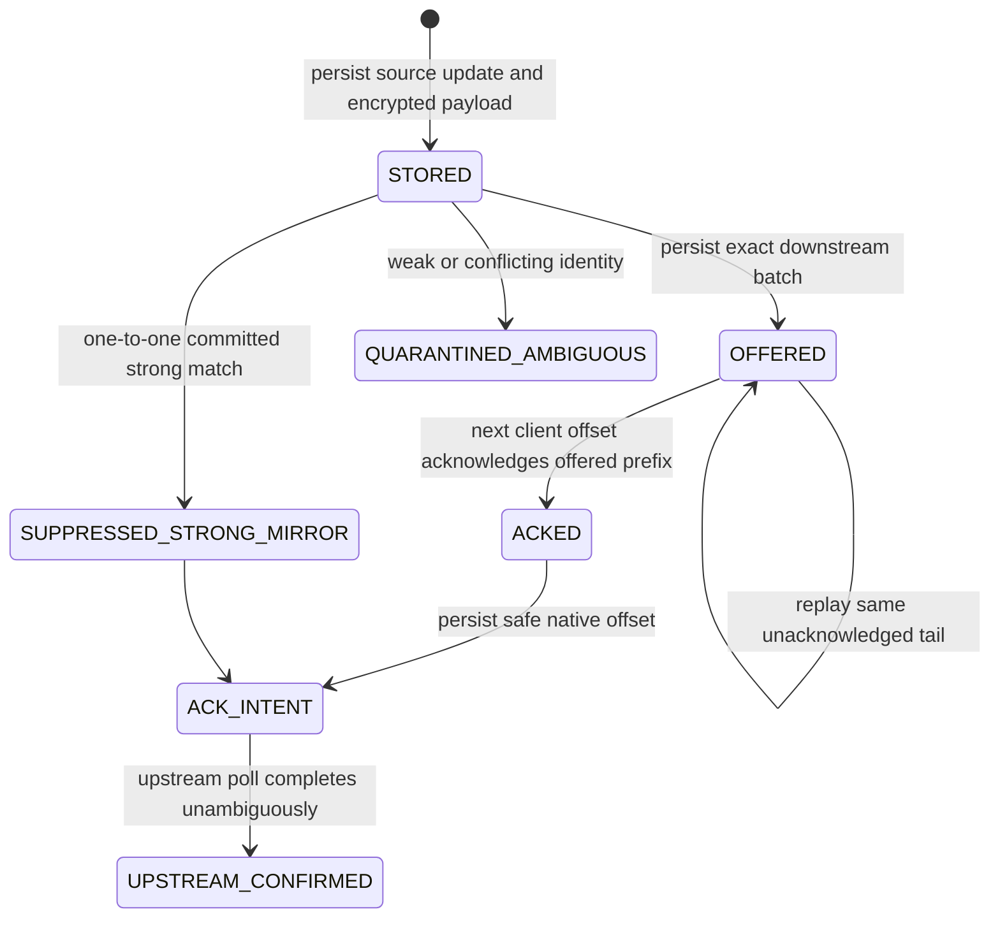

# PR 0: durable reconciliation design and storage decision

Status: design/test infrastructure plus an exact Node engine declaration

Base: `main` at `c301f55`

Production proxy behavior: unchanged

## Verdict: VALIDATED

Question: can the proxy use a driver-neutral SQLite boundary on the deployed
Node 22 runtime and obtain WAL durability, crash recovery, reopen, and online
backup without adding a native production dependency?

Yes. `node:sqlite` on Node `v22.23.1` passed the repository crash, reopen,
integrity, permissions, and online-backup tests. Its API is still marked
experimental by Node, so all driver-specific behavior stays behind the small
adapter contract in `spikes/001-durable-state-storage/`.

`better-sqlite3` remains a credible fallback. Version `13.0.1` was installed in
an isolated temporary prefix on the same Node runtime and passed a one-time WAL,
reopen, online-backup, and integrity probe. That observation is not repository
acceptance evidence: the reproducible suite covers the selected adapter. The
alternative was not selected because it would add a native addon and its
install/update lifecycle without improving the required synchronous
state-machine operations. No `better-sqlite3` dependency is added here.

Decision: use `node:sqlite` for the PR 2 StateStore, retain the driver-neutral
contract, and re-run this spike whenever the supported Node runtime changes.
Switch to `better-sqlite3` if a Node upgrade breaks the tested contract or if
the experimental API cannot satisfy a production requirement.

The supported range is Node `>=22.16.0 <23`: `node:sqlite.backup` first appears
in Node 22.16.0, while Node 23 does not provide it until 23.8.0. The full spike
is validated on `v22.23.1`. A later runtime upgrade requires a deliberate range
update, and PR 2 must still fail startup on a capability probe for both
`DatabaseSync` and `backup`.

## Frozen delivery invariants

These are design constraints for later PRs. PR 0 does not enforce them in the
running proxy.

1. A virtual update ID is allocated once, is never reused, and remains within
   JavaScript's safe-integer range.
2. A `(bot_key, source, generation, native_update_id)` maps to at most one
   logical event and never changes virtual ID.
3. One bot may have at most one active offered batch. Different bots may poll
   concurrently; one bot's polling cycle is serialized.
4. A downstream client offset acknowledges only virtual IDs that were actually
   offered and are strictly below that offset.
5. The proxy does not send an upstream positive offset past an unacknowledged
   source update.
6. A repeated valid client offset replays the stored unacknowledged batch tail
   with byte-equivalent payload and identical virtual IDs.
7. A source switch occurs only after the active batch is fully acknowledged.
   A downstream batch contains updates from one source.
8. Native offsets come only from stored source observations and terminal
   frontiers. Virtual-to-native affine extrapolation is forbidden.
9. Unknown cloud cursors receive neither a high virtual offset nor a negative
   offset. They remain fail closed until a later reconciliation gate.
10. Database corruption or a required-state failure never silently falls back
    to RAM-only enforce behavior.
11. A positive native offset or retry is sent only while a current external
    source-incarnation proof matches both `source_state` and its poll intent.
    A missing or changed proof fails closed; the numeric `generation` alone is
    never proof that an upstream queue survived a reset.
12. Before allocating a virtual ID, the proxy advances and fsyncs an external
    monotonic high-water anchor that is retained independently from DB backups.
    A crash may leave an unused gap; restore may never reuse an issued ID.
13. One unresolved `prepared` or `ambiguous` poll intent blocks every later
    destructive poll for that bot until explicit resolution.
14. An offered batch has no silent discard transition. If its client can never
    acknowledge it, polling remains fail closed until a later PR defines an
    audited operator-recovery protocol.

## ACK-aware state machine



`source_updates.terminal` means ACK-eligible: either the logical event is
downstream-committed or the occurrence is a proven
`SUPPRESSED_STRONG_MIRROR`. The separate `poll_intents.completed` transition
records that Telegram accepted the resulting upstream poll. A
`QUARANTINED_AMBIGUOUS` observation is never ACK-eligible and never advances
the source frontier without an explicit operator decision.

Client offset rules for durable mode:

- negative offset: HTTP 400;
- offset within the active offered batch: acknowledge the offered prefix and
  replay the remaining tail;
- offset below the acknowledged prefix: HTTP 409 `stale-client-offset`;
- offset above `highest_offered + 1`: fail closed as an unknown skip;
- offset zero before any offer: acknowledges nothing.

Crash ordering:

1. A prepared native ACK intent is durable before the upstream request.
2. A crash before an upstream response leaves the intent unresolved. It is safe
   to retry only after re-reading the external source-incarnation manifest and
   proving the evidence still matches; otherwise it becomes `ambiguous` and
   polling fails closed.
3. A crash after the response but before the SQLite transaction gets the native
   updates again because that response did not acknowledge its returned tail.
4. A crash after the SQLite transaction but before the HTTP write replays the
   stored batch.
5. A lost HTTP response does not allocate new virtual IDs for the repeated
   client offset.

Restore gate:

1. Open the backup offline and run `integrity_check`, `foreign_key_check`, and
   schema version/checksum validation.
2. Read the independently retained virtual-ID high-water anchor. In one SQLite
   transaction set `next_virtual_update_id` above the greater of the DB value
   and the external max-ever-issued value. Missing/stale anchor evidence blocks
   listener startup.
3. Re-read current source-incarnation evidence. A prepared/ambiguous intent
   whose evidence no longer matches is never retried and remains an operator
   resolution case.
4. Acquire the process lease before opening the polling listener.

## Fake Telegram queue contract

`test/support/fake-telegram-queue.mjs` is a deterministic upstream simulator for
PR 0 and PR 1 tests.

- `offset=0` returns pending updates without acknowledging any of them.
- A positive offset first removes every `update_id < offset`, then returns the
  remaining queue in native-ID order.
- Applying a high virtual offset to a lower native queue deliberately empties
  that queue; the negative test documents why virtual offsets must never be
  forwarded upstream.
- A second poll while one poll is held open throws a conflict carrying status
  code `409`. The fake rejects the later request to make overlap deterministic;
  this is test instrumentation, not a claim about which real Telegram request
  wins arbitration.
- Negative offsets are rejected because their destructive tail semantics are
  outside the durable polling loop.

## Storage comparison

| Dimension | Node 22 `node:sqlite` | `better-sqlite3` 13.0.1 |
| --- | --- | --- |
| Runtime/API status | Built into the supported runtime; emits an experimental API warning. | Mature external API; MIT; package declares Node `>=22`. |
| Installation | No repository dependency or native-addon install step. | Native addon and about 27.3 MB unpacked package payload for the evaluated version. |
| State-machine shape | Synchronous connection, prepared statements, explicit transactions. | Equivalent synchronous shape. |
| Required pragmas | WAL, foreign keys, recursive triggers, FULL synchronous, and busy timeout verified. | WAL and FULL synchronous verified in the isolated probe. |
| Reopen/backup | Reopen, `integrity_check`, and built-in online backup pass. | Reopen, `integrity_check`, and package online backup pass. |
| Hard-crash test | Committed WAL row survives `SIGKILL`; open transaction rolls back. | Not run because it is not the selected adapter. |
| Operational risk | Coupled to the pinned Node runtime and an experimental API. | Adds native binary/ABI, install, supply-chain, and update responsibilities. |

The adapter contract deliberately exposes only:

- `open(databasePath)`;
- `exec`, `run`, `get`, and `all`;
- synchronous `transaction(work)`;
- `integrityCheck()` and `close()`;
- online `backup(connection, destinationPath)`.

`applyStorageMigration()` first verifies the supplied SHA-256 against the exact
SQL, then runs schema DDL and its `schema_meta` row in one transaction. A
checksum/syntax fault leaves no partial schema. Backup requires a private parent
directory, writes an exclusive hidden `0600` staging file, and publishes it
through a same-directory hard link that fails if the final path or a symlink
already exists.

The spike's `restore-gates.mjs` verifies integrity, foreign keys, and the exact
compiled migration history; rejects missing/stale per-bot allocator anchors;
and compares every unresolved poll intent with normalized external
source-incarnation evidence. Parsing and authenticating the eventual manifest
files remains PR 2 work, as documented below.

Driver-specific row shapes are normalized at this boundary. Async work inside a
database transaction is rejected so a network request can never hold a SQLite
transaction open.

## Schema v1 responsibilities and constraints

The executable design schema is `docs/durable-state-schema-v1.sql`.

| Table | Frozen responsibility |
| --- | --- |
| `schema_meta` | Applied migration version, name, checksum, and time. |
| `bot_state` | Virtual allocator, external allocator-anchor high-water, acknowledged prefix, behavior mode, active source, and ledger epoch/readiness. |
| `source_state` | Independent local/cloud generation, external incarnation evidence, cursor provenance, last observed native ID, and safe ACK frontier. |
| `logical_events` | Immutable virtual ID, encrypted replay payload, versioned fingerprint, and logical delivery state. |
| `source_updates` | Exact source/generation/native observation, logical-event link, disposition, and terminal state. |
| `poll_batches` | Exact encrypted response, client request signature/offset, virtual range, ACK progress, and batch state. |
| `poll_intents` | Durable upstream native offset, source-incarnation evidence, immutable request identity, and `prepared/completed/ambiguous/failed` result. |
| `fingerprint_occurrences` | Versioned HMAC occurrences and guarded one-to-one strong-mirror pairing; fingerprints are deliberately not globally unique. |
| `media_aliases` | Encrypted source-specific `file_id` keyed by logical event, media role, and `file_unique_id`. |
| `process_lease` | One process owner for the database/upstream queues. |
| `state_events` | Payload-free audit markers for important transitions and recovery actions. |

Frozen constraints:

- unique `(bot_key, source, generation, native_update_id)`;
- unique `(bot_key, virtual_update_id)`;
- one active source generation for each bot/source;
- one active offered batch and one unresolved (`prepared` or `ambiguous`) poll
  intent per bot;
- a strong-mirror match requires the same bot, event kind, canonicalizer,
  HMAC key and fingerprint, the opposite source, and one committed,
  non-suppressed target occurrence linked to the same logical event;
- native and virtual IDs must be non-negative safe integers;
- a new native-ID epoch creates a strictly newer generation with new external
  incarnation evidence; an unverified generation may attach evidence once,
  that evidence then becomes immutable and cannot be reused by another
  generation; retirement is final;
- tokens, plaintext payloads, plaintext `file_id` values, and HMAC key material
  are forbidden in the database;
- `safe_ack_native_id` means the greatest observed native ID that a future
  upstream request may safely pass. The request offset is that value plus one;
  an unknown frontier remains `NULL`;
- an observed frontier can advance only to a terminal prefix with no
  quarantined/non-terminal observation at or below it; a verified imported
  frontier requires separate HMAC evidence;
- `allocator_anchor_high_water` is reconciled from the external monotonic
  anchor at startup/restore, and `next_virtual_update_id` must remain above it.
- a poll batch is inserted only as `offered` or `empty`; partial and committed
  states are reachable only through the one-way ACK transition.

The schema deliberately does not claim that `first/last_virtual_update_id`
proves the exact contents of encrypted `response_ciphertext`, or that an
`acknowledged_virtual_prefix` update came from that response. PR 2/PR 3 must
validate response membership, offered-prefix ACKs, allocator gaps, and all
related row changes inside one StateStore transaction. A range-only SQL trigger
would reject valid gaps while still being unable to inspect the encrypted
response, so it would provide a false guarantee.

Table and column names are now fixed for schema v1. PR 2 may add indexes or a
new forward migration, but it must not silently change these meanings.

## Retention decisions

| Data | Retention |
| --- | --- |
| Unacknowledged event payload and active batch response | No automatic expiry. Retain until committed, upstream-confirmed, or explicitly quarantined/exported by an operator. |
| Committed and upstream-confirmed ciphertext | Eligible for purge after 6 hours. Never purge while any source update or poll intent is non-terminal. |
| Media-alias ciphertext | Eligible for in-place purge 48 hours after the last source observation. |
| Payload-free media-alias identity tombstones | Retain for the life of the bot database so an alias cannot be remapped through delete/reinsert. |
| Payload-free fingerprint occurrence tombstones | Retain for the life of the bot database; `expires_at_ms` limits reconciliation eligibility, while the row preserves one-to-one match history. |
| Payload-free `source_updates` mapping tombstones | Retain for the life of the source generation so one native ID can never be remapped after GC. |
| Payload-free `logical_events` identity tombstones | Retain while referenced by a source-update tombstone; clear eligible ciphertext columns instead of deleting the identity row. |
| Continuous ledger warm-up before unknown-cloud reconciliation | At least 26 hours in one compatible epoch with full proxy coverage. |
| Payload-free `state_events` | 30 days. |
| `bot_state`, all `source_state` generation tombstones, schema history, and current lease | Retain while the bot/database exists. |

Garbage collection is a later PR. It must run in bounded transactions, purge
eligible ciphertext in place, and preserve logical/source identity tombstones,
`next_virtual_update_id`, the acknowledged prefix, and safe source frontiers.
Backup retention is an operations decision because it depends on the deployment
location; it is explicitly deferred below.

## Runtime flags

| Flag | Accepted values | Default and validation |
| --- | --- | --- |
| `RECONCILIATION_MODE` | `legacy`, `shadow`, `enforce-local`, `enforce-known-cloud`, `reconcile-cloud` | `legacy`. Applies only to allowlisted bots. |
| `RECONCILIATION_BOT_ALLOWLIST` | Comma-separated unique decimal bot IDs | Empty. Empty means every bot stays on `legacy`. |
| `CLOUD_BOOTSTRAP_MODE` | `disabled`, `manual`, `automatic` | `disabled`. `automatic` is reserved and must fail configuration validation until a later design approval. |
| `STATE_DB_PATH` | Absolute path on a local filesystem | No implicit production path. Required when selected mode is not `legacy` or `STATE_REQUIRED=1`. Network shares are rejected. |
| `VIRTUAL_ID_ANCHOR_PATH` | Absolute path on a separately retained local filesystem | No default. Required for every non-legacy mode. The file is advanced and fsynced before allocation and must not be rolled back with a DB backup. |
| `SOURCE_INCARNATION_MANIFEST_PATH` | Absolute path to an operator-managed bot/source epoch manifest | No default. Required before any positive native offset in enforce modes. Missing/mismatched evidence fails closed; offset zero remains observational. |
| `STATE_REQUIRED` | `0`, `1` | `0`. Value `1` makes integrity/open/lease failure a startup failure. Every enforce mode behaves as required state even if this flag is mistakenly `0`. |

`shadow` with `STATE_REQUIRED=0` may stop shadow recording and alert while the
legacy decision path continues. `shadow` with `STATE_REQUIRED=1`, and every
enforce mode, must not open the polling listener without a healthy database and
lease. No mode creates extra cloud polls merely to populate state.

## Explicitly deferred decisions

1. Deployment-specific absolute database path, systemd ownership, backup
   destination, and backup retention.
2. Exact AEAD algorithm, secret-storage integration, and encryption/HMAC key
   rotation procedure. Encryption of replay payload and `file_id` values is
   mandatory before any production state write.
3. Final canonicalizer registry and strong/weak policy by Telegram update kind.
4. Initial OpenClaw durable high-water import and external allocator-anchor
   manifest formats. The safety rule and separate-retention requirement are
   fixed; serialization and deployment paths remain PR 2 work.
5. Process-lease TTL, heartbeat cadence, and stale-owner recovery runbook.
6. Automatic unknown-cloud bootstrap. The first rollout permits only a manual
   coordinator-owned operation after ledger readiness.
7. Distributed/high-availability StateStore. Schema v1 intentionally supports
   one proxy process per database.

## PR 0 non-goals

- No production proxy import from `spikes/`, `test/`, or the schema.
- No listener, routing, fallback, cursor, file, or multipart behavior change.
- No production database creation or migration.
- No ACK-aware replay, durable source switching, fingerprint suppression, or
  cloud reconciliation implementation.
- No end-to-end exactly-once claim; Telegram, SQLite, OpenClaw, and agent side
  effects do not share one transaction.
- No deployment, service restart, or cloud queue access.

## Verification evidence

- The four fake-queue tests pass: greater-offset ACK, zero-offset replay,
  destructive high-offset negative case, and overlap detection.
- The ten selected-adapter tests pass: atomic schema migration/reopen,
  destructive ACK/incarnation gates, terminal frontier enforcement, guarded
  fingerprint matching, hard-crash recovery, and exclusive online backup.
- The first focused storage run exposed `node:sqlite`'s null-prototype result
  rows. The adapter now normalizes `get`, `all`, and `run` results so this driver
  detail cannot leak into the future state machine.
- The complete suite passes: 18 unchanged proxy regressions plus 14 PR 0 tests,
  32/32 total.
- `git diff --check` is clean, and `src/telegram-bot-api-proxy.mjs` is untouched.

## Reproducible acceptance commands

```bash
node --test test/fake-telegram-queue.test.mjs
node --test test/durable-state-storage-spike.test.mjs
npm run check
git diff --check
```

Next engineering step: review and merge this design/test foundation, then build
PR 1's per-bot coordinator against the fake queue without importing any storage
spike into the production path. PR 2 may adopt the schema and adapter only after
its separate shadow-mode review.
