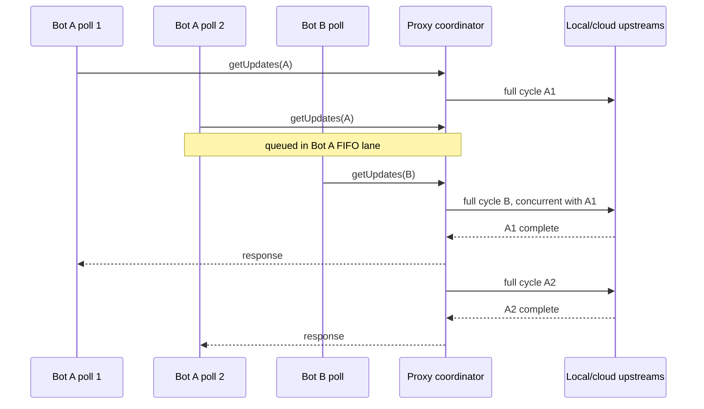

# PR 1: per-bot polling coordinator

Status: behavior-preserving refactor plus process-local concurrency control

Base: PR 0 durable reconciliation foundation

Production state: no SQLite reads or writes; legacy cursor decisions unchanged

## Result

After its bounded body is fully buffered, every `getUpdates` request for one bot
ID enters a FIFO lane before the proxy starts any upstream routing decision.
Different bot IDs use independent lanes and may run concurrently.

The same topology is available as a standalone
[SVG/HTML diagram](per-bot-poll-coordinator-diagram.html).



The bounded request body is read before lane acquisition. An incomplete body or
a request carrying only a public bot ID plus a bogus secret therefore cannot
starve the valid bot lane.

The protected upstream decision cycle includes:

1. local health check;
2. local long poll and every retry;
3. legacy native↔virtual bridge mutation;
4. stale local update filtering and internal `ack-dropped`;
5. cloud pending probe and opt-in rescue;
6. cloud fallback and response rewriting;
7. handing the downstream response to Node with `res.end()`, or a terminal
   routing error.

Locking only the first local request would leave the bridge, fallback cursor,
pending probe, and auxiliary ACK vulnerable to races. They therefore remain
inside the same lane acquisition.

## Cancellation and shutdown

The coordinator distinguishes two cancellation moments:

- A client that disconnects while queued is removed and never reaches an
  upstream.
- A client that disconnects after its cycle starts does not release the lane.
  Telegram may already have accepted the offset, so the proxy completes that
  ambiguous upstream cycle before starting the next poll.

During `SIGTERM`, the coordinator closes all lanes, rejects queued and future
polls, and aborts active work with an internal shutdown signal. Every success,
exception, timeout, cancellation, and shutdown path releases its lane. Empty
lanes are removed from the map to avoid growth with bot cardinality.

The lane is released after `res.end()` accepts the response, without waiting for
a slow client socket to flush every byte. Holding upstream ownership for
arbitrary downstream backpressure would let one paused client starve the bot.
PR 1 serializes upstream side effects and RAM bridge mutations; durable replay
of a response lost after that handoff belongs to the later ACK-aware StateStore.

## Privacy and scope

The lane key is the decimal bot ID extracted from the token. The secret token is
never used as a key, metric label, coordinator event, or log field.

This is a process-local guarantee:

```text
one proxy process + one bot ID → at most one active getUpdates cycle
```

A second proxy process, a direct `getUpdates` consumer, or a webhook can still
compete outside this lock and produce Telegram `409`. A later durable-state PR
must acquire the database process lease before opening the polling listener.

## Refactor boundaries

The monolithic entrypoint now delegates to independently tested modules:

| Module | Responsibility |
| --- | --- |
| `request-parsing.mjs` | Telegram path parsing, body/query offset mutation, timeout cap, buffering classification, and header copying. |
| `fallback-policy.mjs` | Method/status fallback decisions and local-only rules. |
| `file-routing.mjs` | `getFile` source affinity, path rewriting, TTL, and cloud size limit. |
| `update-bridge.mjs` | Existing RAM-only local/cloud cursor guards and virtual-ID translation. |
| `upstream-client.mjs` | Buffered and streaming upstream transport with cancellation and fault points. |
| `runtime-hooks.mjs` | Injectable clock, sleep, and deterministic fault hooks. |
| `per-bot-poll-coordinator.mjs` | FIFO per-bot ownership and lifecycle cleanup. |

No durable `StateStore`, replay batch, ACK protocol, source reconciliation, or
fingerprint suppression is introduced here.

## Acceptance evidence

- all 18 baseline integration tests remain unchanged and pass;
- a frozen raw POST/JSON routing trace from `c301f55` matches exactly;
- same-bot concurrent polls reach upstream with maximum concurrency `1`;
- the same scenario on `c301f55` demonstrates the former `409`;
- two different bots reach upstream concurrently;
- queued and active client disconnect paths behave as specified;
- an incomplete POST body does not acquire or starve the bot lane;
- a failed/timeout owner releases the lane for the next waiter;
- shutdown aborts active work and rejects queued/new work;
- multipart upload remains local-only;
- request, fallback, file, bridge, transport, and coordinator modules have
  focused regression tests.

Run:

```bash
npm run check
git diff --check
```

Rollback is an ordinary code rollback. PR 1 creates no durable state and changes
no migration or production cursor format.
